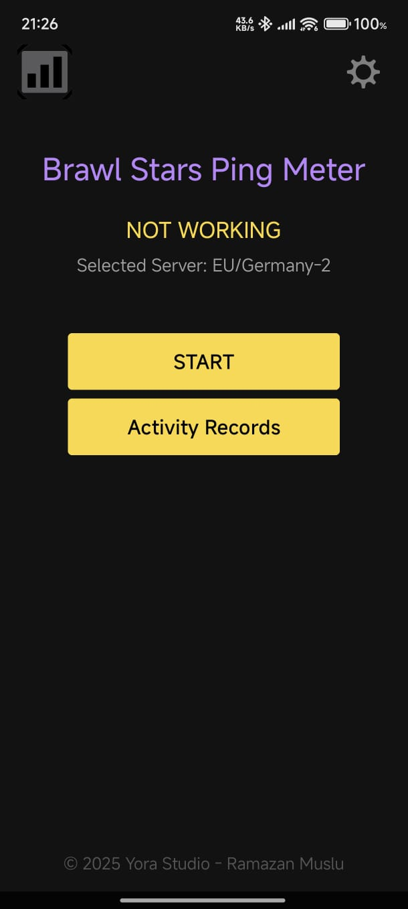
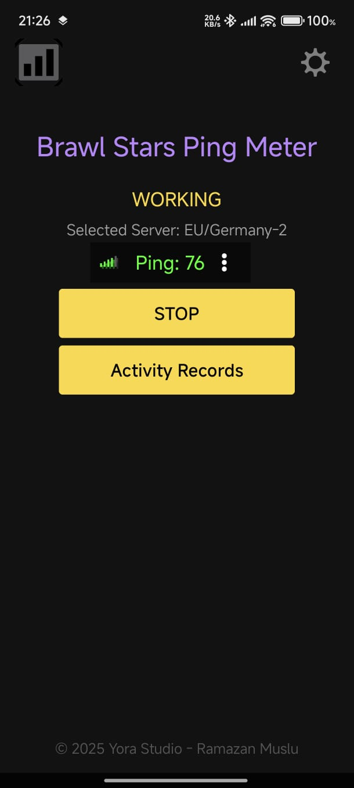
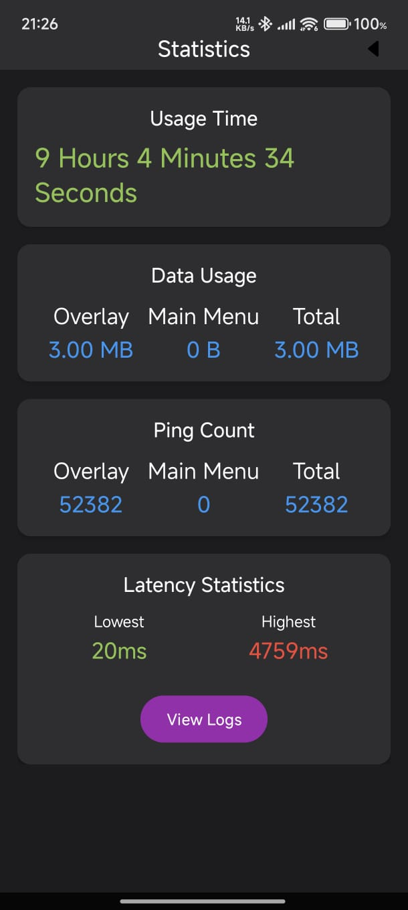
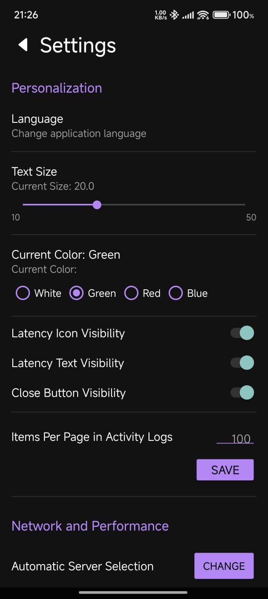
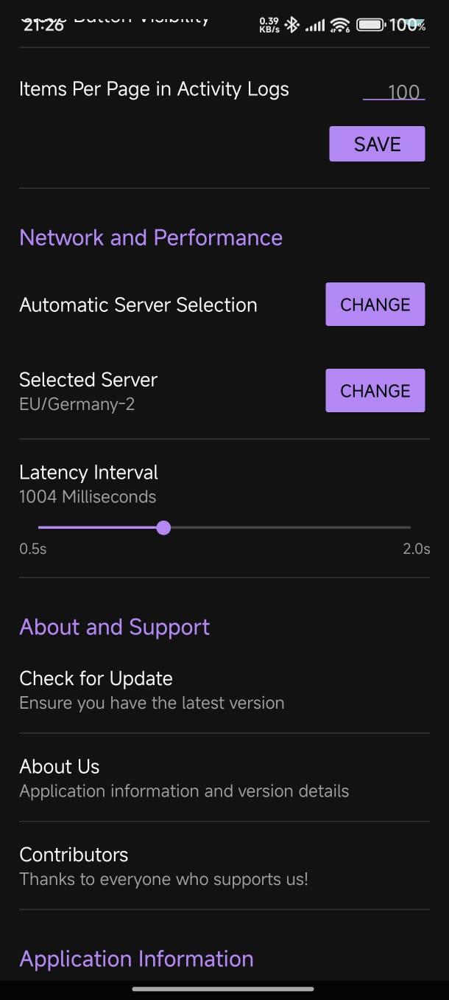

<!--  -->

Overlay ping meter for aws-based online games. Like Brawl Stars, Clash Royale, etc. 

## About
BSMS is a free latency monitoring application.
You can track your real-time ping to your selected server on any part of your screen.
Supports 15+ AWS (Amazon Web Services) servers.
Does not interact with the game you are playing (no risk of being banned).
You can track the latency you experienced in the past.

## 📱 Screenshots
### App Themes
|  |  |  |  |  |  |
|:---:|:---:|:---:|:---:|:---:|:---:|

## Download
| Play Store |
|:-:|
|  |

## Translations
<!-- BEGIN-TRANSLATIONS -->

-100%25-brightgreen)

<!-- END-TRANSLATIONS -->

## Related Tools
